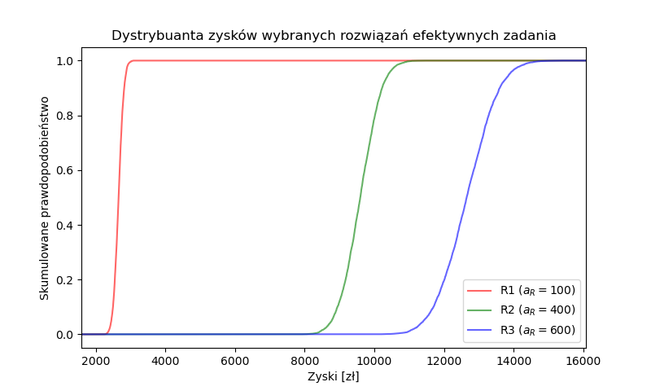

## Zadanie 1

### Założenia

Biorąc pod uwagę poniższe fakty:

* koszty pracy przedsiębiorstwa (magazynowania) są niezależne od zmiennej
  losowej $R$ (dochodów jednostkowych produktów),
* liczba produkowanych produktów jest niezależna od zmiennej losowej $R$,

można uprościć złożone zadanie poszukiwania wartości oczekiwanej łącznych zysków
z pracy przedsiębiorstwa. Zamiast tego wystarczy niezależnie obliczyć wartość
oczekiwaną zmiennej losowej $R$ i za pomocą przekształceń matematycznych uzyskać
wartość oczekiwaną zysków. Dzięki temu nie ma potrzeby generowania próbek z
rozkładu $R$ i uśredniania wyniku końcowego metodą numeryczną, a zamiast tego
można obliczyć analitycznie $\mathbb{E}(R)$ i użyć gotowej wartości przy
rozwiązywaniu zadania optymalizacji.

\begin{align}
\mathbb{E}(z) &= \mathbb{E}(d - k) \nonumber \\
              &= \mathbb{E}(d) - k \nonumber \\
              &= \sum\limits_{p \in P} \sum\limits_{n \in N} \mathbb{E}(x_{pn} \cdot R_p) - k \nonumber \\
              &= \sum\limits_{p \in P} \sum\limits_{n \in N} x_{pn} \cdot \mathbb{E}(R_p) - k \nonumber
\end{align}

gdzie:

* $z$ -- łączne zyski z pracy przedsiębiorstwa w rozważanym czasie [zł],
* $d$ -- łączne dochody z pracy przedsiębiorstwa w rozważanym czasie [zł],
* $k$ -- łączne koszty pracy przedsiębiorstwa w rozważanym czasie [zł],
* $x_{pn} \quad p \in P, n \in N$ -- liczba sprzedanych produktów $p$ w miesiącu $n$ [szt],
* $R_p \quad p \in P$ -- jednostkowy dochód za produkt $p$ (zmienna losowa) [zł/szt],
* $P = \{P1, P2, P3, P4\}$ -- produkty,
* $N = \{1, 2, 3\}$ -- rozpatrywane miesiące.

### Wyznaczanie średnich jednostkowych dochodów dla każdego z produktów

Rozkład t-Studenta jest ciągły, więc wartość oczekiwana na przedziale domkniętym
jest taka sama jak wartość oczekiwana na przedziale otwartym.

\begin{align}
R_1 &\sim Tt_{(5;12)}(9,16;4) \nonumber \\
R_2 &\sim Tt_{(5;12)}(8,9;4) \nonumber \\
R_3 &\sim Tt_{(5;12)}(7,4;4) \nonumber \\
R_4 &\sim Tt_{(5;12)}(6,1;4) \nonumber
\end{align}

<!-- $$\mathbb{E}(R_x) = \mu + \sigma \cdot \frac{\Gamma(3/2) \cdot ((4 + (a)^2)^{-3/2} - (4 + (b)^2)^{-3/2}) \cdot 4^2}{2(F_4(b) - F_4(a))\Gamma(2)\Gamma(1/2)}$$ -->
<!-- t_expected_value = lambda mean, std, a, b: mean + std * (math.gamma(3/2) * ((4 + a**2)**(-3/2) - (4 + b**2)**(-3/2)) * 4**2)/(2 * (stats.t.cdf(b, 4) - stats.t.cdf(a, 4)) * math.gamma(2) * math.gamma(1/2)) -->

$$\mathbb{E}(R_1) = 9 + 4 \cdot \frac{\Gamma(3/2) \cdot ((4 + (-1)^2)^{-3/2} - (4 + (\frac{3}{4})^2)^{-3/2}) \cdot 4^2}{2(F_4(\frac{3}{4}) - F_4(-1))\Gamma(2)\Gamma(1/2)} = 8,63$$
$$\mathbb{E}(R_2) = 8 + 3 \cdot \frac{\Gamma(3/2) \cdot ((4 + (-1)^2)^{-3/2} - (4 + (\frac{4}{3})^2)^{-3/2}) \cdot 4^2}{2(F_4(\frac{4}{3}) - F_4(-1))\Gamma(2)\Gamma(1/2)} = 8,30$$
$$\mathbb{E}(R_3) = 7 + 2 \cdot \frac{\Gamma(3/2) \cdot ((4 + (-1)^2)^{-3/2} - (4 + (\frac{5}{2})^2)^{-3/2}) \cdot 4^2}{2(F_4(\frac{5}{2}) - F_4(-1))\Gamma(2)\Gamma(1/2)} = 7,61$$
$$\mathbb{E}(R_4) = 6 + 1 \cdot \frac{\Gamma(3/2) \cdot ((4 + (-1)^2)^{-3/2} - (4 + (6)^2)^{-3/2}) \cdot 4^2}{2(F_4(6) - F_4(-1))\Gamma(2)\Gamma(1/2)} = 6,42$$

### Model rozwiązania

Zbiory:

* $P = \{P1, P2, P3, P4\}$ -- produkty
* $M = \{SZ, WV, WH, FR, TO\}$ -- maszyny (odpowiednio: szlifierki, wiertarki
    pionowe, wiertarki poziome, frezarki, tokarki)
* $G = \{G1, G2\}$ -- grupy produktów, z których tylko jedną można magazynować w
    danym miesiącu
* $GP = \{(G1, P1), (G1, P2), (G2, P3), (G2, P4)\}$ -- przypisania produktów do
    grup
* $N = \{1, 2, 3\}$ -- rozpatrywane miesiące

Parametry:

* $n_m \quad m \in M$ -- liczba dostępnych maszyn $m$ [brak jednostki]
* $t_{mp} \quad m \in M, p \in P$ -- jednostkowy czas produkcji produktu $p$ na
    maszynie $m$ [h/szt]
* $\mathbb{E}(R_p) \quad p \in P$ -- średni jednostkowy dochód za produkt $p$ [zł/szt]
    (wartości obliczone [powyżej](#wyznaczanie-średnich-jednostkowych-dochodów-dla-każdego-z-produktów))
* $x^{max}_{pn} \quad p \in P, n \in N$ -- maksymalna sprzedaż produktu $p$ w
    miesiącu $n$ [szt]
* $c^{mag} = 1$ -- cena magazynowania jednostki produktu przez miesiąc [zł/szt]
* $m^{max} = 200$ -- maksymalna liczba zmagazynowanych jednostek danego produktu
    na miesiąc [szt]
* $m^{start}_{p}$ -- liczba zmagazynowanych produktów $p$ na start (na koniec
    grudnia) [szt]
* $h^{rob} = 24 \cdot 8 \cdot 2 = 348$ -- liczba godzin roboczych w miesiącu [h]

Zmienne decyzyjne:

* $x_{pn} \quad p \in P, n \in N$ -- liczba sprzedanych produktów $p$ w miesiącu $n$ [szt]
* $p_{pn} \quad p \in P, n \in N$ -- liczba wyprodukowanych produktów $p$ w miesiącu $n$ [szt]
* $m_{pn} \quad p \in P, n \in (\{0\} \cup N)$ -- liczba zmagazynowanych
    produktów $p$ na koniec miesiąca $n$ [szt]
* $u_{gn} \quad g \in G, n \in N$ -- czy grupa produktów $g$ jest magazynowana
    w miesiącu $n$ (zmienna binarna: 0 -- nie, 1 -- tak)

Ograniczenia:

* $x_{pn} \ge 0 \quad \forall p \in P, n \in N$ -- sprzedaż nieujemna
* $p_{pn} \ge 0 \quad \forall p \in P, n \in N$ -- produkcja nieujemna
* $m_{pn} \ge 0 \quad \forall p \in P, n \in N$ -- stan magazynu nieujemny
* $u_{gn} \in \{0, 1\} \quad \forall g \in G, n \in N$ -- zmienna binarna
* $\sum\limits_{p  \in P} p_{pn} \cdot t_{mp} \le h^{rob} \cdot n_m \quad \forall m \in M, n \in N$
    -- łączny czas użycia maszyny $m$ w miesiącu $n$ nie przekracza liczby roboczych godzin
* $x_{pn} \le x^{max}_{pn} \quad \forall p \in P, n \in N$ -- sprzedaż produktu $p$
    nie przekracza rynkowego limitu na miesiąc $n$
* $m_{p0} = m^{start}_{p} \quad \forall p \in P$ -- początkowy stan magazynu dla
    produktu $p$
* $\sum\limits_{g \in G} u_{gn} \le 1 \quad \forall n \in N$ -- w miesiącu $n$ może być
    wybrana maksymalnie jedna grupa produktów $g$ do magazynowania
* $\sum\limits_{\{p : (g, p) \in GP\}} m_{pn} \le m^{max} \cdot u_{gn} \quad \forall g \in G, n \in N$
    -- produkt $p$ należący do grupy $g$ może być magazynowany maksymalnie w
    liczbie $c^{max}$ szt, jeśli grupa $g$ jest wybrana do magazynowania, lub w
    liczbie 0 szt w przeciwnym wypadku
* $p_{pn} + m_{p(n-1)} = x_{pn} + m_{pn} \quad \forall p \in P, n \in N$
    -- dla każdego miesiąca $n$ i produktu $p$ sztuki wyprodukowane i pozostałe
    w magazynach z poprzedniego miesiąca muszą zostać sprzedane lub
    powtórnie zmagazynowane

Cel:

* $\max \ \sum\limits_{n \in N} \sum\limits_{p \in P} (x_{pn} \cdot \mathbb{E}(R_p) - m_{pn} \cdot c^{mag})$
    -- maksymalizacja łącznego zysku, czyli różnicy dochodu ze sprzedaży
    produktów i wydatków na magazynowanie produktów na przestrzeni rozpatrywanych
    miesięcy (koszty magazynowania na miesiąc grudzień pominięte)

### Wyniki działania modelu

Powyższy model został zaimplementowany w języku AMPL i uruchomiony przy użyciu
solwera CPLEX. Implementacja znajduje się w plikach: `src/z1.{dat,mod,run}`.
Poniżej wyniki działania.

Wartość funkcji celu:

$$\sum\limits_{n \in N} \sum\limits_{p \in P} (x_{pn} \cdot \mathbb{E}(R_p) - m_{pn} \cdot c^{mag}) = 14531 \ [zł]$$

* $x_{pn}, p_{pn}, m_{pn} \quad p \in P, n \in N$ -- liczba sprzedanych,
  wyprodukowanych i zmagazynowanych produktów $p$ w miesiącu $n$ [szt]

  * $n = 1$ (styczeń)

    | $p$ | $x_{p1}$ | $p_{p1}$ | $m_{p1}$ |
    |-----|----------|----------|----------|
    | P1  |      200 |      200 |        0 |
    | P2  |        0 |        0 |        0 |
    | P3  |       50 |      100 |        0 |
    | P4  |      150 |      200 |        0 |

  * $n = 2$ (luty)

    | $p$ | $x_{p2}$ | $p_{p2}$ | $m_{p2}$ |
    |-----|----------|----------|----------|
    | P1  |      300 |      300 |        0 |
    | P2  |      100 |      100 |        0 |
    | P3  |      200 |      200 |        0 |
    | P4  |      200 |      200 |        0 |

  * $n = 3$ (marzec)

    | $p$ | $x_{p3}$ | $p_{p3}$ | $m_{p3}$ |
    |-----|----------|----------|----------|
    | P1  |        0 |        0 |        0 |
    | P2  |      300 |      300 |        0 |
    | P3  |      100 |      100 |        0 |
    | P4  |      200 |      200 |        0 |

* $u_{gn} \quad g \in G, n \in N$ -- czy grupa produktów $g$ jest magazynowana
    w miesiącu $n$ (zmienna binarna: 0 -- nie, 1 -- tak)

  | $g$ \\ $n$ | 1 | 2 | 3 |
  |------------|---|---|---|
  | G1         | 0 | 0 | 0 |
  | G2         | 1 | 1 | 1 |

### Wnioski z wyników

* Ograniczenia na maksymalny obrót produktem zostały w całości wykorzystane.
* Żadne z ograniczeń na maksymalny czas użycia maszyn nie miało znaczenia,
  rzeczywiste wykorzystanie maszyn było zawsze dużo mniejsze niż limit.
* Z poprzedniego punktu wynika, że magazynowanie było zbędne (nie licząc stanu
  magazynu na koniec grudnia). Sama produkcja wysyciła limit na obrót każdym z
  produktów, więc nie było sensu dopłacać za magazynowanie produktów.
* Koszty produkcji są zerowe (brak magazynowania; koszty materiałów nie są
  rozważane w zadaniu).

## Zadanie 2

### Założenia

Tym razem model będzie rozważał również miarę ryzyka przy generacji rozwiązań.
Nie uda się zatem uniknąć generacji próbek (scenariuszy) z rozkładu zmiennej
losowej $R$ jak w przypadku pierwszego zadania, bo nie byłoby sposobu na
obliczenie wartości miary ryzyka.

Rozwiązywane zadanie jest wielokryterialne, należy zatem zastosować jedną z
metod generacji rozwiązań efektywnych dla zadań wielokryterialnych.

Początkowym moim pomysłem było podejście progowe (ograniczenie ryzyka do
kolejnych konkretnych wartości i maksymalizowanie wartości oczekiwanej zysków).
Niestety takie podejście, o ile w tym przypadku zdawało się dawać zadowalające
wyniki, to nie gwarantuje generacji wyłącznie rozwiązań efektywnych. Wynika to z
faktu, że nic nie stoi na przeszkodzie, żeby wygenerowany punkt nie był
zdominowany przez inny punkt o takiej samej wartości oczekiwanej profitu, ale
nieco mniejszym ryzyku.

W związku z powyższym, w końcowym rozwiązaniu zastosowałem zamiast tego metodę
punktu referencyjnego. Ma ona tę wadę, że parametry końcowego rozwiązanie będą
się z dużym prawdopodobieństwem nieco różnić od zadanych progów, jednak w zamian
wygenerowane rozwiązanie będzie z pewnością rozwiązaniem efektywnym.

Do implementacji metody punktu referencyjnego użyłem ,,inżynierskiej'' wersji
maksymalizacji leksykograficznej. Parametr $\rho$ reguluje istotność drugiego
kryterium (sumy) w tej metodzie.

### Model rozwiązania

Rdzeń modelu rozwiązania będzie identyczny jak w przypadku zadania 1. Zmiany będą dotyczyły:

* obliczania wartości oczekiwanej dochodów,
* dodania elementów związanych z ryzykiem,
* zmiany funkcji celu na taką zgodną z metodą punktu referencyjnego dla
  kryteriów: zysku i ryzyka.

Zbiory:

* $S = \{1, 2, ..., 500\}$ -- scenariusze

Parametry:

* $\mathbb{E}(R_p) \quad p \in P$ -- parametr usunięty
* $R_{ps} \quad p \in P, s \in S$ -- jednostkowy dochód za produkt $p$ dla
  scenariusza $s$ [zł/szt]
* $\rho$ -- istotność drugiego kryterium (sumy) w metodzie punktu referencyjnego
  [brak jednostki]
* $a_{r}$ -- wartość aspiracji dla ryzyka w metodzie punktu referencyjnego [zł]
* $a_{z}$ -- wartość aspiracji dla średnich zysków w metodzie punktu
  referencyjnego [zł]
* $\lambda_{r}$ -- istotność ryzyka w metodzie punktu referencyjnego [brak
  jednostki]
* $\lambda_{z}$ -- istotność średnich zysków w metodzie punktu referencyjnego
  [brak jednostki]

Zmienne:

* $r_s \quad s \in S$ -- odchylenie zysków ze scenariusza $s$ od średniej [zł]
* $r_s^+, r_s^- \quad s \in S$ -- odpowiednio ,,nadmiar'' i ,,niedobór'' zysków
  ze scenariusza $s$ w stosunku do średniej [zł]; służą do obliczenia wartości
  bezwzględnej we wzorze na odchylenie przeciętne
* $r^{śr}$ -- wartość odchylenia przeciętnego zysków (miara ryzyka) [zł]
* $z_s \quad s \in S$ -- łączny zysk dla scenariusza $s$ [zł]
* $z^{śr}$ -- wartość oczekiwana łącznego zysku [zł]
* $f$ -- minimum z wartości odchylenia: profitu lub ryzyka od aspiracji w
  metodzie punktu referencyjnego

Ograniczenia:

* $r_s^+, r_s^- \ge 0 \quad \forall s \in S$ -- ,,nadmiary'' i ,,niedobory''
  zysków są nieujemne
* $r_s = r_s^+ - r_s^-$ -- odchylenie zysków ze scenariusza $s$ od średniej
  składa się z ,,nadmiaru'' i ,,niedoboru''
* $r_s = z^{śr} - z_s \quad \forall s \in S$ -- obliczanie odchylenia zysków ze
  scenariusza $s$ od średniej
* $r^{śr} = \sum\limits_{s \in S} (r_s^+ + r_s^-) \cdot \frac{1}{|S|}$ --
  obliczanie odchylenia przeciętnego; zakładam, że prawdopodobieństwa
  scenariuszy są jednakowe, dlatego we wzorze występuje dzielenie przez liczność
  scenariuszy
* $z_s = \sum\limits_{n \in N} \sum\limits_{p \in P} (x_{pn} \cdot R_{ps} - m_{pn} \cdot c^{mag}) \quad \forall s \in S$
  -- obliczanie łącznego zysku dla scenariusza $s$; analogicznie jak funkcja
  celu w zadaniu 1, jednak zamiast wartości oczekiwanej zmiennej losowej $R$
  jest wartość konkretnej próbki
* $z^{śr} = \sum\limits_{s \in S} z_s \cdot \frac{1}{|S|}$ -- obliczanie
  średniego łącznego zysku względem wszystkich scenariuszy
* $f \le \lambda_z (z^{śr} - a_z)$ -- wartość minimalna odchylenia w metodzie
  punktu referencyjnego jest mniejsza lub równa niż odchylenie średniego profitu
  od aspiracji
* $f \le \lambda_r (a_r - r^{śr})$ -- wartość minimalna odchylenia w metodzie
  punktu referencyjnego jest mniejsza lub równa niż odchylenie miary
  przeciętnego odchylenia od aspiracji; wartości w nawiasie są zamienione
  miejscami, bo przeciętne odchylenie jest minimalizowane

Cel:

* $lexmax \ (f, \lambda_z (z^{śr} - a_z) + \lambda_r (a_r - r^{śr}))$ -- funkcja celu dla metody punktu referencyjnego: maksymalizacja w pierwszej kolejności minimum z odchyleń od aspiracji, a w drugiej kolejności sumy wszystkich odchyleń. Funkcja $lexmax$ jest realizowana metodą ,,inżynierską'' w następujący sposób:

  $$\max \ f + \rho(\lambda_z (z^{śr} - a_z) + \lambda_r (a_r - r^{śr}))$$

### Generacja scenariuszy

W celu otrzymania próbek zmiennej losowej $R$ dla poszczególnych scenariuszy,
znalazłem bibliotekę [_Truncated Normal and Student's t-distribution
toolbox_](https://www.mathworks.com/matlabcentral/fileexchange/53796-truncated-normal-and-student-s-t-distribution-toolbox?s_tid=prof_contriblnk)
do programu _MatLab_, która pozwala na generację próbek z wielowymiarowego
rozkładu t-Studenta z ograniczoną dziedziną. Kod generujący próbki znajduje się
w pliku `src/generate_samples.m`, a wynik jego działania jest w
`out/z2-samples.csv`.

Próbki należało również przekształcić do formatu `.dat` w celu odczytania przez
AMPL, dlatego napisałem też skrypt `src/samples_to_dat.py`, który na podstawie
pliku `.csv` generowanego z _MatLaba_ tworzy plik `out/z2-samples.dat`.

### Wyniki działania modelu

Powyższy model został zaimplementowany w języku AMPL i uruchomiony przy użyciu
solwera CPLEX. Implementacja znajduje się w plikach: `src/z2.{dat,mod,run}`.
Dodatkowo pliki `src/z2-a.run` i `src/z2-c.run` uruchamiają model dla kilku
wartości aspiracji $a_r$ na potrzeby podpunktów _a_ i _c_.

Nastawy parametrów metody punktu referencyjnego są dla każdego uruchomienia stałe z wyjątkiem $a_r$ i równe:

* $\rho = 0.000001$ -- wyznaczony eksperymentalnie tak, by drugie kryterium nie
  zakłócało działania pierwszego
* $\lambda_r = 1000$, $\lambda_z = 0.001$ -- większy poziom istotności dla miary
  ryzyka zapewnia, że ustawiona wartość aspiracji odchylenia przeciętnego będzie
  bardzo blisko faktycznej wartości odchylenia przeciętnego dla rozwiązania
* $a_z = -500$ -- wartość poniżej najgorszej z możliwych (dla $r^{śr} = 0$:
  $z^{śr} = -300$); dzięki temu model będzie w pierwszej kolejności próbował
  zrealizować aspirację dla ryzyka

#### Zbiór rozwiązań efektywnych

W celu wyznaczenia zbioru rozwiązań efektywnych w przestrzeni ryzyko-zysk,
uruchomiłem model dla różnych wartości aspiracji $a_r$. Wyniki dla $a_r \ge 820$
zaczynają się powtarzać, co oznacza że w tym przypadku średni zysk osiągnął już
swoją maksymalną wartość.

| $a_r$ | $r^{śr}$ | $z^{śr}$  |
|-------|----------|-----------|
| 0     |   0      |  -300     |
| 20    |  19.999  |   529.344 |
| 40    |  39.9983 |  1208.7   |
| 60    |  59.9976 |  1888.06  |
| 80    |  79.9969 |  2567.41  |
| 100   |  99.9963 |  3246.77  |
| ...   | ...      | ...       |
| 740   | 739.986  | 13674.1   |
| 760   | 759.986  | 13830.2   |
| 780   | 779.986  | 13986.2   |
| 800   | 799.985  | 14142.2   |
| 820   | 816.903  | 14274.2   |
| 840   | 816.903  | 14274.2   |

Następnie otrzymane wyniki naniosłem na wykres. Na wykresie odwróciłem oś OX, bo ryzyko jest minimalizowane.

Widać, że żadne z widocznych rozwiązań nie dominuje żadnego innego, co sugeruje, że zadanie się udało.

#### Rozwiązanie maksymalnego zysku

znajduje się na wykresie na lewym krańcu zbioru. Posiada ono wartość średniego
zysku $z^{śr} = 14274.4$ zbliżoną do wyniku z pierwszego zadania, co sugeruje
poprawność wykonania obu zadań. Wtedy ryzyko wynosi ok. $r^{śr} = 816.9$.

#### Rozwiązanie minimalnego ryzyka

znajduje się na wykresie na prawym krańcu zbioru. Posiada ono ujemną wartość
średniego zysku $z^{śr} = -300$ przy zerowym ryzyku. Oznacza to, że dla każdego
ze scenariuszy zysk wynosi $-300$ zł. Takie rozwiązane, o ile efektywne w
zadanym problemie wielokryterialnym, jest oczywiście całkowicie niedopuszczalne
dla każdego rozsądnego decydenta i zdominowane w sensie FSD przez wiele innych
rozwiązań. Prawdopodobnie w wyznaczonym zbiorze istnieje więcej takich
problematycznych rozwiązań.

#### Analiza dominacji FSD

została przeprowadzona dla 3 rozwiązań. Ich punkty aspiracji ryzyka to: $100$,
$400$ i $740$. Rozwiązania oznaczę odpowiednio $R1$, $R2$ i $R3$. Dzięki
analizie FSD można sprawdzić, czy któreś z nich jest zdominowane przez inne.

Poniżej tabela posortowanych niemalejąco ocen dla wybranych rozwiązań.

| $R1$    | $R2$    | $R3$    |
|---------|---------|---------|
| 3049.11 | 9011.18 | 12380.8 |
| 3079.62 | 9091.47 | 12410.4 |
| 3106.42 | 9189.33 | 12738.9 |
| 3123.18 | 9215.99 | 12798.3 |
| 3149.31 | 9417.94 | 12830.1 |
| 3151.1  | 9485.39 | 12918.8 |
| 3178.67 | 9489.04 | 12987.6 |
| 3186.79 | 9535.02 | 13348.5 |
| 3216.31 | 9567.75 | 13498.9 |
| 3227.2  | 9630.19 | 13519.5 |
| 3246.77 | 9763.32 | 13583.6 |
| 3246.77 | 9763.32 | 13895.0 |
| 3246.77 | 9815.82 | 14056.7 |
| 3249.58 | 9998.72 | 14104.1 |
| 3261.01 | 10000.3 | 14105.5 |
| 3302.55 | 10154.7 | 14255.4 |
| 3346.59 | 10202.7 | 14461.4 |
| 3418.84 | 10216.9 | 14669.9 |
| 3476.56 | 10478.4 | 14718.3 |
| 3672.19 | 11238.8 | 16200.6 |

Już tutaj widać, że $R1 \prec_a R2 \prec_a R3$. Ponieważ zadanie jest
sprowadzalne do problemu wyboru jednakowo prawdopodobnych loterii, to można
wywnioskować, że również $R1 \prec_{FSD} R2 \prec_{FSD} R3$, jednak poniższy
wykres dystrybuanty zysków pokazuje to lepiej.

Dystrybuanta również jednoznacznie pokazuje, że $R1 \prec_{FSD} R2 \prec_{FSD}
R3$. Aby otrzymywać jedynie rozwiązania FSD-efektywne, należałoby zmienić
podejście generacji rozwiązań.
